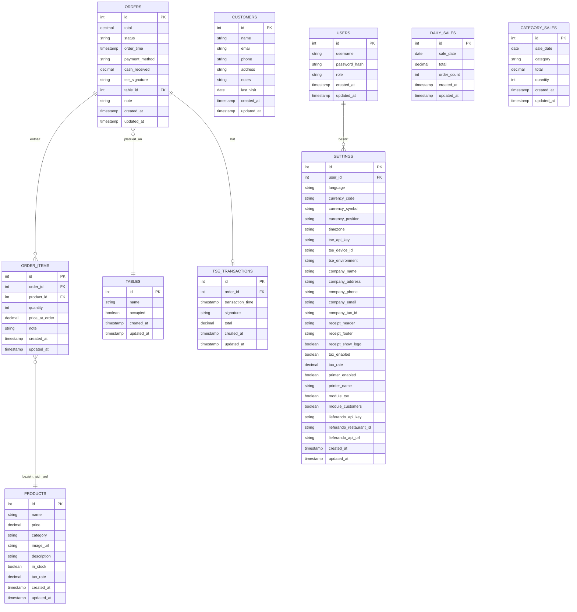

# Backend-Server-Plan für Stockke POS

Dieser Plan beschreibt die Implementierung eines Backend-Servers mit MySQL-Datenbankintegration für das Stockke POS-System. Der Server wird alle benötigten Tabellen in der MySQL-Datenbank erstellen und eine GraphQL-API für die Kommunikation mit dem Frontend bereitstellen.

## 1. Technologie-Stack

Die Hauptkomponenten unseres Stacks sind:
- **Node.js mit Express**: Als grundlegende Server-Plattform
- **Apollo Server**: Für die GraphQL-API-Implementierung
- **TypeORM**: Für die typsichere Datenbankinteraktion
- **MySQL**: Als zugrundeliegende Datenbank

## 2. Datenbankstruktur

